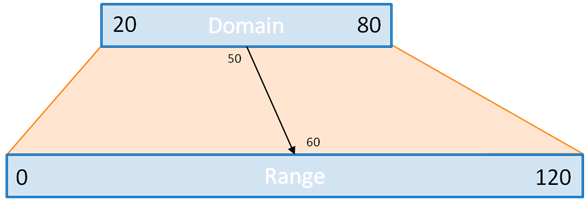

# D3 Visualizations {#d3}

While the [D3 library](https://d3js.org/) can be used to do fundamental DOM manipulations and event handling, the true power of the library comes in its ability to create **dynamic, data-driven visualizations**&mdash;graphical representations of data sets that can change in response to changes in the data. In particular, D3 provides robust tools that make it easy to relate (**join**) the _DOM elements_ shown on the screen (most commonly, SVG shapes) to the values in a data _array_. Then it is just up to you to specify how the data should be related to _visual properties_ of the DOM in order to create a visualization.

This chapter will introduce the basics of creating data-driven visualizations using using D3, including data joining, data scaling, axes and decorations, and animations.

## The Data Join
To start, consider an **array of objects** representing a _table_ of data (similar to what you've seen before):

```js
var peopleTable = [
    {name: 'Ada', mathExam: 100, spanishExam: 83},
    {name: 'Bob', mathExam: 82, spanishExam: 88},
    {name: 'Chris', mathExam: 78, spanishExam: 92},
    {name: 'Diya', mathExam: 91, spanishExam: 79},
    {name: 'Emma', mathExam: 93, spanishExam: 87}
];
```

At its most basic level, a **data visualization** is a graphical image whose components (e.g., shapes) represent different elements in the array (observations/rows of the data). For example, a bar chat may have a single `rectangle` for each element in the array, a scatter plot may have a single `circle` for each element, and a line chart may have a `path` with a different "control point" for each element. D3 will let you _programmatically_ associate an SVG element (or set of elements) with each element in a JavaScript array in order to define this visualization. For example, each of the five items in the above `peopleTable` could be associated with one of five `<rect>` elements in a bar chart.

Moreover, you also want each shape in your visualization to have a different appearance based on the properties (_fields_) of the data. For example, the `width` attribute of a `<rect>` may depend on the `mathExam` of the array element, and the `y` attribute may depend on the _index_ of that element in the array. Thus you need to define a **mapping** between data properties and the [___visual attributes___](http://www.infovis-wiki.net/index.php?title=Visual_Variables) (size, position, color, etc.) of each component in the visualization.

D3 lets you create a mapping between an _array_ of data and a _selection_ of DOM elements&mdash;what is called **the data join** (the "joining" of data with the selection). You establish this mapping by calling the **`data()`** method _on_ the selection of DOM elements, and passing in the array of data you wish to map to those elements:

```js
var rects = svg.selectAll('rects');  //selection of all rects in the SVG
var dataJoin = rects.data(peopleTable);  //join with the people table
```

This _join_ associates each element in the array with a single element in the selection pair-wise (e.g., the first DOM element is associated with the first array element, the second with second, and so on).

Once data has been joined to the selection, it is possible to modify the attributes of the DOM elements (as you've done previously) utilizing that element's associated **datum** (data item). You do this by passing a _callback function_ to the `attr()` method. This callback function can take in the _datum_ and the _index_ in the array as arguments, and should return the appropriate value for the attribute for that particular element:

```js
//a function that determines width of a rectangle based on a datum
var calcWidth = function(datum, index){
    return datum.mathExam;  //width is the math score
}

//set the width attribute, using the callback to calculate the width
//for each (joined) element in the selection
dataJoin.attr('width', calcWidth);
```

- Remember that the `attr()` function is _vectorized_, so called individually on each element in the selection!

- Note that the `index` was not used&mdash;technically, you could have left it out of the argument list!

- If you wish to refer to the DOM element itself inside the callback function, that value is assigned to a local variable called **`this`**.

As you may have guessed, we almost always use _anonymous callback functions_ for this, and abbreviate the arguments to `d` and `i` to save space:

```js
//this is equivalent to the above
dataJoin.attr('width', function(d,i) { return d.mathExam; });  //compact one-line!
```

You can of course use this process to specify all of the different attributes of an SVG element, including sizes, positions, fill and stroke colors, etc. It is also possible to pass a calculating callback function to most selection methods (including e.g. the `style()` function if you want to use CSS styles).

- Similarly, the `on()` event handler callback takes in the _datum_ and _index_ as arguments, if you wish to refer to the joined data when a user clicks on an element!

### Entering and Exiting Elements
Importantly, it is possible that the _size_ of the data array might not match the size of the selection! While the data table might have 5 elements (as above), the selection might have 3, 6, or even 0 `<rect>` elements! In this situation, you cannot just join the the data to the selection, since there isn't a one-to-one mapping.

In D3, any joined _data_ elements that lack corresponding DOM elements are referred to as the **enter selection** (they are data elements that need to "enter" the visualization). They can be accessed by calling the **`enter()`** method _on the data join_. This will return a selection of null-like "placeholder" elements, each of which is joined with a data item (that didn't otherwise have an element to join with). Most commonly, you then use the `append()` method to create a new DOM element for each item in this selection:

```html
<!-- Assume an empty list -->
<ul id="#list"></ul>
```

```js
//add a <li> for each number in an array:
var listItems = d3.select('#list').selectAll('li');  //select the (zero) <li> elements
var dataJoin = listItems.data([3, 1, 4, 1, 5]);  //join with an array of data
var enterSelection = dataJoin.enter();  //get the enter selection
enterSelection.append('li') //add a new <li> for each "placeholder"
    .text(function(d){ return d; })  //set the text to be the datum
```

This would produce the DOM tree:

```html
<ul id="#list">
  <li>3</li>
  <li>1</li>
  <li>4</li>
  <li>1</li>
  <li>5</li>
</ul>
```

Note that we can and do chain most of these calls together, rather than defining a separate `enterSelection` variable.

<div class="alert alert-warning">
**Important!** Notice how this lets you create elements for data without needing to specify any DOM for those elements ahead of time! This means that you do not need to write any SVG elements in the HTML, and instead can just `append()` elements for the `enter()`ing data.
</div>

Equivalently, any _DOM elements_ that lack a joined data element are referred to as the **exit selection** (they are DOM elements that need to "exit" the visualization). They can be accessed by calling the **`exit()`** method _on the data join_. This will return a selection of elements, none of which have a datum joined to them. Most commonly, you then use `remove()` to remove these data-less elements from the DOM:

```js
//select the above HTML (5 <li> elements)
var listItems = d3.select('#list').selectAll('li');  //select the (5) <li>
var dataJoin = listItems.data([3,4,5]);  //join with an (smaller) array of data
var exitSelection = dataJoin.exit();  //get the exit selection
exitSelection.remove() //remove the extraneous <li>
```

To summarize:

- `data()` returns the items in the data array ___and___ in the DOM
- `enter()` returns items in the data array ___and not___ in the DOM
- `exit()`  return items in the DOM ___and not___ in the data array

#### Object Consistency
As data is "entering" and "exiting" over time (e.g., in response to user interaction), it is important to make sure that you are _consistent_ about the mapping between the data and DOM elements. If you do a second data join with a smaller array of data (a sub-list), you want to make sure you remove the correct elements (and not just the ones at the end of the list). Similarly, if you do a data join with a larger array of data, you want to make sure you append elements only for the data that isn't already shown.

By default, the `data()` join will associate the first datum with the first DOM element, the second datum with the second DOM element, and so on. But this means that if you later remove the first datum element, then "which" DOM element is associated with which datum will change (e.g., the previously-second datum will be joined with the first DOM element). This can cause problems, particularly for utilizing [animations](https://bost.ocks.org/mike/constancy/).

In order to make sure that your joining remains consistent, you specify a second argument to the `data()` function, known as the **key function**. This is a _callback function_ (which takes the datum and index as arguments, as usual) that should return a _unique string identifier_ for each datum&mdash;in effect, the "key" that D3 can use to look up that datum when joining:

```js
//rectangle selected from above example
var rects = svg.selectAll('rects');
var dataJoin = rects.data(peopleTable, function(d) {
    return d.name;  // use the `name` property as the "key"
});
```

It is common to use properties such as `name` or `id` as the key function&mdash;if you are familiar with databases, these would be the [foreign keys](https://en.wikipedia.org/wiki/Foreign_key).

<p class="alert alert-danger">
**Caution**, when you first call the `data()` function, the key function callback is executed once for each DOM element already in the selection, _and then_ once for each new datum in the data. This means that if your selection included any un-joined DOM elements (e.g., because you started off with some hard-coded `<rect>` elements), then the `datum` argument to the callback will be `undefined`. The best solution for this is to always `append()` entering DOM elements!
</p>

#### The General Update Pattern
When modifying the visualized data in response to user interaction, it is very common for a data join to include both "entering" and "existing" data (e.g., some new data added, and some old data removed). In fact, whenever you do a data join, there are 3 possible situations:

1. The data is _"updating"_, and the DOM attributes need to be modified accordingly. This data were previously joined to DOM elements, and so will be included in the `data()` selection.
2. The data is _"incoming"_, and so new elements need to be added to the DOM. This data will be included in the `enter()` selection.
3. The data is _"outgoing"_, and so elements need to be removed from the DOM. This data will be included in the `exit()` selection.

As such, "updating" a visualization with a new data join involves a few steps, as detailed below:

```js
function update(newDataArray) {
    //perform the data join with the "new" data list
    var rects = svg.selectAll('rect')
                  .data(newDataArray, keyFunc);  //use key function for consistency

    //Update already bound elements (that are not coming or going)
    rects.classed('updated', true);  //e.g., add style class to updating

    //Handle entering data
    var present = rects.enter().append('rect')  //add new DOM elements
                .classed('new', true)  //e.g., add style class to entering
                .merge(rects); //save new DOM elements in a selection

    //Handle now present data (the merged selection)
    present.classed('here', true);  //e.g., add style class to current (including new)

    //Handle exiting data (from original selection)
    rects.exit().remove();
}
```

The stages of this process are:

1. Use `data()` to join the elements; modify the attributes of any that are bound.
2. Use `enter()` to create new elements; modify the attributes of the new elements.
3. Use `merge()` to combine the old and new; modify the attributes of anything that will stay.
4. Use `exit()` to remove old elements.

The above example encapsulates these steps into a function for re-use!

This process is known as the [_General Update Pattern_](https://bl.ocks.org/mbostock/3808218), and is the recommended way of handling _dynamic_ (interactive) data visualizations. Every time the data needs to change&mdash;whether because the user interacted with the web page, or the the data was being "live streamed" from an API&mdash;you call this general update function. The function will join the now-current data to visualize, and then update the DOM elements that make up the visualization in order to match the latest data.

In developing the `update()` function, you should specify what the visualization should look like for _any_ set of data. Then you can change the data however you want, and the visualization will continue to reflect the data!

## Animation
D3 is primarily used for _dynamic_ data visualizations, in which the data being represented may change over time (otherwise, you would just use Illustrator or a charting library). While the _General Update Pattern_ allows you to easily implement consistent changes to the visualization when the data set change, you often want to add a "wow" factor by having those changes be **animated**. Elements should fly to their new position, slide into place, fade in or out, or perform some other kind of visual change over a short time. This can help the user understand what is going on as the data changes, as well as make the visualization seem more "smooth".

With D3, you can animate element changes by using [**transitions**](https://github.com/d3/d3-transition). A transition applies changes to an element (e.g, `attr()` method calls) over a length of time, rather than instantaneously. For example, rather than instantly changing an rectangle's `width` attribute from `0` to `100`, you could have that attribute take 1 second to change, causing the rectangle to "grow".

<p class="alert alert-info">
D3 transitions use [linear interpolation](https://en.wikipedia.org/wiki/Linear_interpolation) to determine the value of the attributes at different times. So if you transitioned the width from `0` to `100` over 1 second, at the start of the second the width would be `0`, at the end it would be `100`, and halfway through (at 0.5 seconds) it would be `50`.
</p>

You create a transition by calling the **`transition()`** method on a selection. This creates a new `transition`, upon which you can call normal DOM manipulation methods (specifically: `attr()`, `style()` and `text()`):

```js
d3.selectAll('rect').attr('width', 10).attr('height', 10);  //start at size 10

d3.selectAll('rect').transition()  //create a transition
    .attr('width', 100)   //call attribute to change over time
    .attr('height', 100)  //this will animate simultaneously
```

This example will cause the rectangle to "grow"! Note that in practice, anything after a `transition()` call in a method chain will be animated.

By default, transitions occur over 250 milliseconds (0.25 seconds). However, you can call additional methods on the `transition` in order to adjust this duration:

```js
d3.selectAll('rect').transition()  //create a transition
    .duration(1000)  //animation takes 1000ms (1 second)
    .delay(100)      //wait 100ms before starting
    .attr('width', 100)   //call attribute to change over time
    .attr('height', 100)  //this will animate simultaneously
```

You can use a sequence of `transition()` calls to make multiple transitions that occur one after another:

```js
d3.selectAll('rect')
    .transition()  //create a transition
        .attr('width', 100)   //first change the width
    .transition()  //a second transition (occurs afterwards)
        .attr('height', 100)  //then change the height
```

Transitions are a fun addition to include with any dynamic visualization; just add the `transition()` call into the chain before you update the attributes! Indeed, in the _General Update Pattern_, transitions can be used for all three of entering, exiting, and updating elements. See [this demo](https://bl.ocks.org/mbostock/3808234) for an example.

## Margins and Positioning
When implementing a visualization, you often want to position groups of elements together. For example, you may want all of the circles in a scatter plot to be "centered" in the `<svg>` image, with some white space on the side (a **margin**) to use for titles or axis labels. While it is possible to do this positioning by carefully specifying the attributes (e.g., add `30` to each element's `x` attribute to give 30 pixels of white space), that can become tedious and error-prone&mdash;particularly if you want to change the spacing later!

However, it is possible to do this easily using SVG (with or without D3)! You are able to **group** SVG elements together by nesting them inside of a `<g>` (**g**roup) element. A `<g>` acts somewhat like a `<div>` in HTML&mdash;it has no visual appearance on its own, but can help to semantically organize DOM elements. You can even give `<g>` elements `id` attributes, allowing you to easily select just the shapes inside of that group.

All elements in a `<g>` will be positioned **relative to the group**. A `<rect>` with an `x` of `0` will be positioned at the edge of its parent `<g>`&mdash;where-ever that `<g>` happens to be! Thus you can easily add margins to groups of elements by nesting them in a `<g>`, and then positioning that `<g>` correctly

The easiest way to position a `<g>` element is to specify it's [**`transform`**](https://developer.mozilla.org/en-US/docs/Web/SVG/Attribute/transform) attribute. This attribute takes as a value a string representing how that element should "move" (be transformed). The "transformation string" is written like a sequence of space-separated function calls, each specifying a different movement that should be applied. For example:

```html
<g transform="translate(20,50)">  <!-- move 20 in x, 50 in y -->
   <rect x=0 y=0 width=20 height=20 fill="red"></rect>
   <rect x=0 y=30 width=20 height=20 fill="blue"></rect>
</g>
```

specifies that a group should be <a href="https://en.wikipedia.org/wiki/Translation_(geometry)">**translated**</a> or moved by 20 units (pixels) in the x direction and 50 units in the y direction.

- Other transformations include `rotate(degrees)` to rotate an element _counterclockwise_ by the given degrees. You can both translate and rotate (in that order) using e.g., `transform="translate(20,50) rotate(45)"`.

- All SVG elements support the `transform` attribute. In fact, angle can be used as a visual attribute!

In D3, you use `<g>` groups to do positioning by creating a group with the appropriate transformation (constructing the "transformation function string" using String concatenation), then appending elements to that group:

```js
var group = svg.append('g') //add a group
    //move over to add margins (specified as variables)
    .attr('transform','translate('+marginLeft+','+marginTop+')')

//do the normal data joining
group.selectAll('rect').data(myData)  //select all the rectangles in that group
    .enter().append('rect')  //create new rectangles as normal
      .attr('x',0)  //will be relative to the <g>
      .attr('y',0)  //will be relative to the <g>
```

The margins are usually specified using variables. See [this demo](https://bl.ocks.org/mbostock/3019563) for an example (note: it uses D3 version 3).

## Scales
In the `peopleTable` example, we _mapped_ exam scores to the `width` attribute directly: each point on an exam corresponded to a single unit (pixel) of width. But what if you were visualizing very small data (e.g., daily interest on a small investment) or very large data (e.g., number of books held by a library)? You would need to _scale_ the values used: that is, $0.001 earnings might be 20 pixels, or 100 books might be a single pixel.



In D3, a **scale** is a function that _maps_ from the data ___domain___ (in data values) to the visualization's ___range___ (in pixel values) in a consistent way. For example, if you wanted to perform the scaling illustrated in the above diagram you would need to have the _domain_ of 20 to 80 (length of 60) map to the _range_ of 0 to 120 (length of 120). You could write a function that does the math to do this for any individual value within the range!

```js
var diagramScale = function(value){
  var domainLength = 80-20; //length of domain
  var rangeLength = 120-0; //length of range

  //transform value to be between 0 and domainLength
  var shifted = value - 20;  //e.g., 50 => 30

  //scale (enlarge) the domain to the range
  var rangeValue = shifted*(rangeLength/domainLength);  //e.g., 30 => 60

  return rangeValue;
}

//example
var result = diagramScale(50);  //60, as above
```

This math is doable, but can be tedious&mdash;especially if the mapping needs to be more complex (such as using a _logarithmic_ scale, or scaling values like colors).

Because scaling is such a common operation, D3 provides a set of [helper functions](https://github.com/d3/d3-scale) that can be used to easily generate these _scaling functions_, allowing you to quickly specify a mapping (and dynamically change that mapping if the domain of the displayed data changes!)

You can create a simple (linear) scale by calling the `d3.scaleLinear()` function. This function **returns a new function** that can be used to do the scaling!

```js
//create the scale function
var diagramScale = d3.scaleLinear()
                       .domain([20,60]) //specify the domain
                       .range([0,120]); //specify the range

var result = diagramScale(50); //60, as above
var source = diagramScale.invert(60); //50, get the domain value from the range
```

<p class="alert alert-warning">
Important: the returned `diagramScale` is a function! _Functions are values_, and in the `linearScale()` function returns a function as its result (instead of a string or an array).
</p>

You "set" the domain and range for the resulting function by calling the `domain()` and `range()` functions on it respectively. These functions take in an array of two or more values which are used to specify "stops" where a particular domain value will map to a particular range value. Any values in between these stops will be [linearly interpolated](https://en.wikipedia.org/wiki/Linear_interpolation) (hence the "linear scale").

Note that it is also possible to use _colors_ as range values, producing a nice [gradient](https://en.wikipedia.org/wiki/Color_gradient):

```js
var scaleColor = d3.scaleLinear()
                     .domain([-100, 0, 100])
                     .range(['red', 'white', 'green']);  //using named colors

scaleColor(100);  //rgb(0, 128, 0), or green
scaleColor(0);    //rgb(255, 255, 255), or white
scaleColor(-50);  //rgb(255, 128, 128), or pink (between red and white)
```

It is also possible to specify more options for a scale function by calling additional methods on it. For example, `clamp()` will make sure a domain value doesn't go outside the range, and `nice()` will make sure the domain starts on nice round values. You can also use the `d3.min()` and `d3.max()` helper methods to perform a **reducing** operating on an array to get its minimum or maximum value (similar to the Python functions). This is useful when specify the domain values to be dependent on some external data.

D3 supports creating non-linear scaling functions as well. For example, `d3.scaleLog()` will produce a logarithmic mapping, and `d3.saleOrdinal()` will produce an [ordinal](https://en.wikipedia.org/wiki/Ordinal_data) mapping. See [the documentation](https://github.com/d3/d3-scale) for a complete list of options.

### Axes
Scales allow you to effectively position elements based on the data they represent. Additionally, you often would like to display the scales to the user, so that they know what values are associated with what positions. You do this by including **axes** (plural of **axis**) in your visualization. An axis is a ___visual representation of a scale___ that the user is able to see, and are used to explain to the _human_ what the shapes in the visualization are depicting.

Since axes involve numerous elements to display (the axis bar, tick marks, labels on those tick marks, etc), D3 includes [_helper functions_](https://github.com/d3/d3-axis) that can be used to easily create these elements: `d3.axisBottom()` creates an axis with the tick marks and labels on the bottom, `d3.axisLeft()` creates an axis with the ticks and labels on the left, etc. You pass these functions the _scale_ that you want to create an axis for:

```js
var xScale = d3.scaleLinear().domain([20,60]).range([0,120]);  //the scale
var xAxis = d3.axisBottom(xScale);  //make an axis for that scale
```

Like scales, an axis (returned by the `axisBottom()` function) **is itself a function**&mdash;you can think of it as an "axis creator" function. When called, the function will create all of the appropriate DOM elements (in the correct positions!) for the axis, _appending_ those elements to the argument of the function:

```js
var axisGroup = svg.append('g')  //create and position a group to hold the axis
    .attr('transform', 'translate('+axisXPosition+','+axisYPosition+')');
xAxis(axisGroup);  //create the axis in that group
```

However, since this requires creating a separate variable for the "parent" of the axis, it is more common to have the _parent element itself_ execute the axis creator function **as a callback function** by using the `call()` method:

```js
svg.append('g')  //create and position a group to hold the axis
    .attr('transform', 'translate('+axisXPosition+','+axisYPosition+')')
    .call(xAxis);  //call the axis creator function
```

With the `call()` method, the "executing" object (e.g., what you call the method on) will be passed in as the first argument to the callback (similar to a **pipe**)&mdash;and since that is what the axis generator function expected, it will be able to create the axis in the correct location!

- The `call()` method can also be used to "abstract" attribute modifications into separate functions for readability and ease of use:

    ```js
    //a function that applies "styling" attributes to the selection
    function styleShape(selection){
    selection
        .attr('fill', 'gold')
        .attr('stroke', 'rebeccapurple')
        .attr('stroke-width', 5);
    }

    dataJoin.enter().append('rect')  //create new rects for each data element
        .call(styleShape) //apply styling to those elements!
    ```

As with _transitions_ and _scales_, there are [numerous methods](https://github.com/d3/d3-axis) you can use to customize the axis created by the axis function. The most common options involve styling the tick marks by calling the `ticks()` method on the axis. This method usually takes two arguments: the number of tick marks to include, and a [format string](https://github.com/d3/d3-format) specifying the format of the labels:

```js
var xAxis = d3.axisBottom(xScale);  //make an axis for that scale
xAxis.ticks(7, '.0f')  //7 tick marks, format with 0 numbers after the decimal
```

The second argument is a formatting string similar to that used in Python string formatting. You can also specify this formatting using the `d3.format()` function. See [this tool](http://bl.ocks.org/zanarmstrong/05c1e95bf7aa16c4768e) to experiment with options.


## Resources {-}
Note that some of these resources may not be up-to-date with D3 version 4.0 (what we are importing by default).

<div class="list-condensed">
- [D3 Tutorials (Official)](https://github.com/d3/d3/wiki/Tutorials),
    - [Three Little Circles (Bostock)](http://bost.ocks.org/mike/circles/)
    - [Thinking with Joins (Bostock)](https://bost.ocks.org/mike/join/)
    - [General Update Pattern (Bostock)](http://bl.ocks.org/mbostock/3808218)
    - [Margin Convention](https://bl.ocks.org/mbostock/3019563)
- [Interactive Data Visualization for the Web (Murray)](http://chimera.labs.oreilly.com/books/1230000000345/index.html)
    - [Scales](http://chimera.labs.oreilly.com/books/1230000000345/ch07.html)
    - [Axes](http://chimera.labs.oreilly.com/books/1230000000345/ch08.html)
- [D3 Scales and Colors](http://www.jeromecukier.net/blog/2011/08/11/d3-scales-and-color/) (v3, but a good summary of features)
- [Interactive Information Visualization (Freeman)](https://info474-s17.github.io/book/). See in particular Chapter 12-14.
</div>
