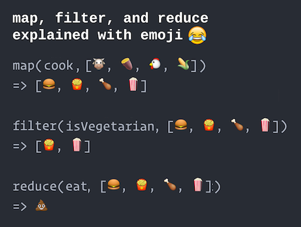

# Functional Programming

This chapter introduces techniques from **Functional Programming**, which is a programming paradigm centered on _functions_ rather than on _variables_ and statements as you've been doing so far (known as _imperative programming_). Functional programming offers another way to think about giving "instructions" to a computer, which can make it easier to think about and implement some algorithms. While not a completely functional language, Python does contain a number of "functional-programming-like" features that can be mixed with the imperative strategies we're used to, allowing for more compact, readable, and "Pythonic" code in some cases.

## Functions ARE Variables
Previously we've described functions as "named sequences of instructions", or groupings of lines of code that are given a name. But in a functional programming paradigm, functions are _first-class objects_&mdash;that is, they are "things" (values) that can be organized and manipulated _just like variables_.

In Python, **functions ARE variables**:

```python
# create a function called `say_hello`
def say_hello(name):
    print("Hello, "+name)

# what kind of thing is `say_hello` ?
type(say_hello)  # <class 'function'>
```

Just like `x = 3` defines a variable for a value of type `int`, or `msg = "hello"` defines a variable for a value of type `string`, the above `say_hello` function is actually a variable for a _value_ of type `function`!

<div class="alert alert-warning">
Note that we refer to the function by its name _without_ the parentheses!
</div>

<div class="alert alert-info">
This is why it is possible to accidentally "overwrite" built-in functions by assigning values to variables like `sum`, `max`, or `dict`.
</div>

The fact that functions **are** variables is the core realization to make when programming in a functional style. You need to be able to think about functions as **things** (nouns), rather than as **behaviors** (verbs). If you imagine that functions are "recipes", then you need to think about them as _pages from the cookbook_ (that can be bound together or handed to a friend), rather than just the sequence of actions that they tell you to perform.

And because functions are just another type of variable, they can be used **anywhere** that a "regular" variable can be used. For example, functions are values, so they can be assigned to other variables!

```python
# Create a function `say_hello`
def say_hello(name):
    print("Hello, "+name)

# Assign the `say_hello` value to a new variable `greet`
greet = say_hello

# Call the function assigned to the `greet` variable
greet("world")  # prints "Hello world"
```

It helps to think of functions as just a special kind of list. Just as _lists_ have a special syntax `[]` (bracket notation) that can be used to "get" a value from the list, _functions_ have a special syntax `()` (parentheses) that can be used to "call" and run the function.

Moreover, functions are values, so they can be _passed as parameters to other functions_!

```python
# Create a function `say_hello`
def say_hello(name):
    print("Hello, "+name)

# A function that takes ANOTHER FUNCTION as an argument
# This function will call the argument function, passing it "world"
def do_with_world(func_to_call):
  # call the given function with an argument of "world"
  func_to_call("world")

# Call `do_with_world`, saying the "thing to do" is `say_hello`
do_with_world(say_hello)  # prints "Hello world"
```

In this case, the `do_with_world` function will _call_ whatever function it is given, passing in a value of `"world"`. (You can think of this as similar to having a function that accesses the `'world'` key of a given dictionary).

**Important note**: when you pass `say_hello` as an argument, you don't put any parentheses after it! Putting the parentheses after the function name _calls_ the function, causing it to perform the lines of code it defines. This will cause the expression containing the function to _resolve_ to its returned value, rather than being the function value itself. It's like passing in the baked cake rather than the recipe page.

```python
def greet():  # version with no args
    return "Hello"

# Print out the function
print(greet)  # prints <function greet>, the function

# Resolve the expression, then print that out
print(greet())  # prints "Hello", which is what `greet()` resolves to.
```

A function that is passed into another is commonly referred to as a **callback function**: it is an argument that the other function will "call back to" and execute when needed.

Functions can take more than one _callback function_ as arguments, which can be a useful way of _composing_ behaviors.

```python
def do_at_once(first_callback, second_callback):
    first_callback()  # execute the first function
    second_callback()  # execute the second function
    print("at the same time! ")

def pat_head():
    print("pat your head", end=" ")

def rub_belly():
    print("rub your belly", end=" ")

# Pass in the callbacks to "do at once"
do_at_once(pat_head, rub_belly)
```

This idea of _passing functions are arguments to other functions_ is at the heart of functional programming, and is what gives it expressive power: you can define program behavior primarily in terms of the behaviors that are run, and less in terms of the data variables used.

### lambdas: Anonymous Functions
You have previously used **anonymous variables** in your programs, or values which are not assigned a variable name (so remain anonymous). These values were defined as _literals_ or expressions and passed directly into functions, rather than assigning them to variables:

```python
my_list = [1,2,3]  # a named variable (not anonymous)
print(my_list)  # pass in non-anonymous variable
print([1,2,3])  # pass in anonymous value
```

Because functions **are** variables, it is also possible to define **anonymous functions**: functions that are not given a name, but instead are passed directly into other functions. In Python, these anonymous functions are referred to as **lambdas** (named after [lambda calculus](https://en.wikipedia.org/wiki/Lambda_calculus), which is a way of defining algorithms in terms of functions).

Lambdas are written using the following general syntax:

```python
lambda arg1, arg2: expression_to_return
```

You indicate that you are defining a lambda function with the keyword `lambda` (rather than the keyword `def` used for named functions). This is followed by a list of arguments separated by commas (what normally goes inside the `()` parentheses in a named function definition), then a colon `:`, then the expression that will be _returned_ by the anonymous function.

For example, compare the following named and anonymous function definitions:

```python
# Named function to square a value
def square(x):
    return x**2

# Anonymous function to square a value
lambda x: x**2

# Named function to combine first and last name
def make_full_name(first, last):
    return first + " " + last

# Anonymous function to combine first and last name
lambda first, last: first + " " + last
```

You're basically replacing `def` and the function name with the word `lambda`, removing the parentheses around the arguments, and removing the `return` keyword!

Just as other expressions can be assigned to variables, lambda functions can be assigned to variables in order to give them a name. This is the equivalent of having defined them as named functions in the first place:

```python
square = lambda x: x**2
make_full_name = lambda first, last: first + " " + last
```

There is one major restriction on what kind of functions can be defined as anonymous lambdas: they must be functions that consist of **only** a single returned expression. That is, they need to be a function that contains exactly one line of code, which is a `return` statement (as in the above examples). This means that lambdas are ___short___ functions that usually perform very simple transformations to the arguments... exactly what you want to do with functional programming!

## Functional Looping
Why should you care about treating functions as variables, or defining anonymous lambda functions? Because doing so allows you to _replace loops with function calls_ in some situations. For particular kinds of loops, this can make the code more _expressive_ (more clearly indicative of what it is doing).

### Map
For example, consider the following loop:

```python
def square(n):  # a function that squares a number
    return n**2

numbers = [1,2,3,4,5]  # an initial list

squares = []  # the transformed list
for number in numbers:
    transformed = square(number)
    squares.append(transformed)
print(squares)  # [1, 4, 9, 16, 25]
```

This loop represents a **mapping** operation: it takes an original list (e.g., of numbers 1 to 5) and produces a _new_ list with each of the original elements transformed in a certain way (e.g., squared). This is a common operation to apply: maybe you want to "transform" a list so that all the values are rounded or lowercase, or you want to _map_ a list of words to a list of their lengths. It is possible to make these changes uses the same pattern as above: create an empty list, then loop through the original list and `append` the transformed values to the new list.

However, Python also provides a _built-in function_ called **`map()`** that directly performs this kind of mapping operation on a list without needing to use a loop:

```python
def square(n):  # a function that squares a number
    return n**2

numbers = [1,2,3,4,5]  # an initial list

squares = list(map(square, numbers))
print(squares)  # [1, 4, 9, 16, 25]
```

The `map()` function takes a list and produces a _new_ list with each of the elements transformed. The `map()` function should be passed two arguments: the second is the list to transform, and the first is the _name of a callback function_ that will do the transformation. This callback function must take in a _single_ argument (an element to transform) and return a value (the transformed element). 

Note that in Python 3, the `map()` function returns an _iterator_, which is a list-like sequence similar to that returned by a dictionary's `keys()` or `items()` methods. Thus in order to interact with it as a list, it needs to be converted using the `list()` function.

The `map()` callback function (e.g., `square()` in the above example) can also be specified using an anonymous lambda, which allows for concisely written code (but often at the expense of readability&mdash;see _List Comprehensions_ below for a more elegant, Pythonic solution).

```python
numbers = [1,2,3,4,5]  # an initial list
squares = list(map(lambda n:n**2, numbers))
```

### Filter
A second common operation is to **filter** a list of elements, removing elements that you don't want (or more accurately: only keeping elements that you DO want). For example, consider the following loop:

```python
def is_even(n):  # a function that determines if a number is even
    remainder = n % 2  # get remainder when dividing by 2 (modulo operator)
    return remainder == 0  # True if no remainder, False otherwise

numbers = [2,7,1,8,3]  # an initial list

evens = []  # the filtered list
for number in numbers:
    if is_even(number):
      evens.append(number)
print(evens)  # [2, 8]
```

With this **filtering** loop, we are _keeping_ the values for which the `is_even()` function returns true (the function determines "what to let in" not "what to keep out"), which we do by appending the "good" values to a new list.

Similar to `map()`, Python provides a _built-in function_ called **`filter()`** that will directly perform this filtering:

```python
def is_even(n):  # a function that determines if a number is even
    return (n % 2) == 0  # True if no remainder, False otherwise

numbers = [2,7,1,8,3]  # an initial list

evens = list(filter(is_even, numbers))
print(evens)  # [2, 8]
```

The `filter()` function takes a list and produces a _new_ list that contains only the elements that _do match_ a specific criteria. The `filter()` function takes in two arguments: the second is the list to filter, and the first is the _name of a callback function_ that will do the filtering. This callback function must take in a _single_ argument (an element to consider) and return `True` if the element should be included in the filtered list (or `False` if it should not be included).

Because `map()` and `filter()` both produce list-like sequences, it is possible to take the returned value from one function and pass it in as the argument to the next. For example:

```python
numbers = [1,2,3,4,5,6]

# Get the squares of EVEN numbers only
filtered = filter(is_even, numbers)  # filter the numbers
squares = map(square, filtered)  # map the filtered values
print(list(squares))  # [4, 16, 36]

# Or in one statement, passing results anonymously
squares = map(square,
          filter(is_even,
          numbers))  # watch out for the parentheses!
print(list(squares))  # [4, 16, 36]
```

This structure can potentially make it easier to understand the code's intent: it is "`square`ing the `is_even` `numbers`"!

### Reduce
The third important operation in functional programming (besides _mapping_ and _filtering_) is **reducing** a list. Reducing a list means to _aggregate_ that lists values together, transforming the list into a single value. For example, the built-in `sum()` function is a _reducing_ operation (and in fact, the most common one!): it reduces a list of numbers to a single summed value. Thus you can think of `reduce()` as a _generalization_ of the `sum()` function&mdash;but rather than just adding (`+`) the values together, `reduce()` allows you to specify what operation to perform when aggregating (e.g., [multiplication](https://en.wikipedia.org/wiki/Factorial)).

Because the `reduce()` function can be complex to interpret, it was actually _removed_ from the set of "core" built-in functions in Python 3 and relegated to the `functools` module. Thus you need to import the function in order to use it:

```python
from functools import reduce
```

To understand how a _reduce_ operation works, consider the following basic loop:

```python
def add_twice(initial, new_amount): # a function that adds a second number twice
    return initial + new_amount + new_amount

numbers = [1,2,3,4,5]  # an initial list

running_total = 0  # an accumulated aggregate
for number in numbers:
    running_total = add_twice(running_total, number)
print(running_total)  # 30  (0+2*1+2*2+2*3+2*4+2*5)
```

This loop **reduces** the list into an "accumulated" product (factorial) of all the numbers in the list. Inside the loop, the `multiply()` function is called and passed the "current total" and the "new value" to be combined into the aggregate (_in that order_). The resulting total is then reassigned as the "current total" for the next iteration.

The **`reduce()`** function does exactly this work: it takes as arguments a _callback_ function used to combine the current running total with the new value, and a list of values to combine. Whereas the `map()` and `filter()` callback functions each took 1 argument, the `reduce()` callback function requires **2** arguments: the first will be the "running total", and the second will be the "new value" to mix into the aggregate. (While this ordering doesn't influence the factorial example, it is relevant for other operations):

```python
def add_twice(initial, new_amount): # a function that adds a second number twice
    return initial + new_amount + new_amount

numbers = [1,2,3,4,5]  # an initial list

product = reduce(add_twice, numbers, 0) # start aggregating with 0
print(running_total)  # 30  (0+2*1+2*2+2*3+2*4+2*5)
```

Note that the `reduce()` function aggregates into a single value, so the result doesn't need to be converted from an _iterator_ to a list!

To summarize, the `map()`, `filter()`, and `reduce()` operations work as follows:



All together, the **map**, **filter**, and **reduce** operations form the basis for a functional consideration of a program. Indeed, these kinds of operations are very common when discussing data manipulations: for example, the famous [MapReduce](https://en.wikipedia.org/wiki/MapReduce) model involves "mapping" each element through a complex function (on a different computer no less!), and then "reducing" the results into a single answer.

## List Comprehensions
While `map()` and `filter()` are effective ways of producing new lists from old, they can be somewhat hard to read (particularly when using anonymous lambda functions, which you often would want to do for simple transformations). Instead, a more idiomatic and "Pythonic" approach (preferred by language developer Guido van Rossum) is to use **List Comprehensions**. A _list comprehension_ is a special syntax for doing mapping and/or filtering operations on list using the `for` and `if` keywords you are familiar with.

A basic list comprehension has the following syntax:

```python
new_list = [output_expression for loop_variable in sequence]
```

For example, a list comprehension to **map** from a list of numbers to their squares would be:

```python
numbers = [1,2,3,4,5]  # original list
squares = [n**2 for n in numbers]
print(squares)  # [1, 4, 9, 16, 25]
```

List comprehensions are written inside square brackets **`[]`** and use the same `for ... in ...` syntax used in for loops. However, the _expression_ that you would normally `append()` to the output list when mapping (or that is returned from an anonymous lambda function) is written _before_ the `for`. This causes the above comprehension to be read as _"a list consisting of `n**2` (n squared) for each `n` in `numbers`"_&mdash;it's almost English!

You can contrast a list comprehension with the same mapping operation done via a loop or via a `map()` and a lambda:

```python
# with a loop
squares = []
for n in numbers:
    squares.append(n**2)  # append expression

# with a lambda
squares = list(map(lambda n: n**2, numbers))  # map with lambda

# with a list comprehension
squares = [n**2 for n in numbers]  # map with list comprehension
```

Notice that all 3 versions specify a _transformation expression_ (`n**2`) on a input variable (`n`). They just use different syntax (punctuation and ordering) to specify the transformation that should occur.

List comprehensions can also be used to **filter** values (even as they are being mapped). This is done by specifying an `if` filtering condition after the sequence:

```python
new_list = [output_expression for loop_variable in sequence if condition]
```

Or as a specific example (remember: we filter for elements to _keep_!):

```python
numbers = [2,7,1,8,3]
evens = [n for n in numbers if n%2 == 0]
print(evens)  # [2, 8]
```

This can be read as _"a list consisting of `n` for each `n` in `numbers`, but only `if` `n%2 == 0`"_. It is equivalent to using the `for` loop:

```python
evens = []
for n in numbers
    if n%2 == 0:  # check the filter condition
        evens.append(n)  # append the expression
```

Finally, it is possible to include _multiple, nested_ `for` and `if` statements in a list comprehension. Each successive `for ... in ...` or `if` expression is included inside the square brackets after the output expression. This allows you to effectively convert nested control structures into a comprehension:

```python
entrees = ["chicken","fish","veggies"]
sides = ["potatoes", "veggies"]

# Get all "meals" if the entree and side are not the same
meals = [ entree+" & "+side for entree in entrees for side in sides if entree != side]
print(meals)  # ['chicken & potatoes', 'chicken & veggies', 'fish & potatoes',
              #  'fish & veggies', 'veggies & potatoes']
              # Note: no "veggies and veggies" !
```

This is equivalent to the nested loops.

```python
meals = []
for entree in entrees:
    for side in sides:
        if entree != side:
            meals.append(entree+" & "+side)
```

(This _almost_ acts like a **reduce** operation, reducing two lists into a single one... but it doesn't exactly convert).

Overall, list comprehensions are considered a _better, more Pythonic_ approach to functional programming. However, `map()` `filter()` and `reduce()` functions are a more generalized approach that can be found in multiple different languages and contexts, including other data-processing languages such as R, Julia, and JavaScript. Thus it is good to be at least familiar with both approaches!


## Resources {-}
<div class="list-condensed">
- [Functional Programming in Python (IBM)](https://www.ibm.com/developerworks/library/l-prog/) (note: Python 2)
- [Map, Filter, Lambda, and List Comprehensions in Python](http://www.u.arizona.edu/~erdmann/mse350/topics/list_comprehensions.html) (note: Python 2)
- [Functional Programming in Python (O'Reilly)](http://www.oreilly.com/programming/free/files/functional-programming-python.pdf) (short eBook)
- [List Comprehensions (Python Docs)](https://docs.python.org/3/tutorial/datastructures.html#list-comprehensions)
- [List Comprehensions Explained Visually](http://treyhunner.com/2015/12/python-list-comprehensions-now-in-color/)
- [Functional Programming HOWTO](https://docs.python.org/3/howto/functional.html) (advanced, not recommended)
</div>
