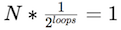
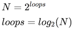
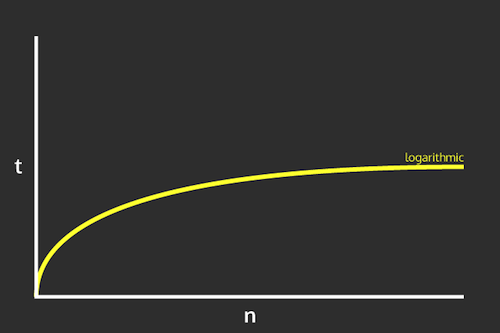

# Searching and Efficiency {#searching}

One of the most common and important uses of computer programs is to **search** a large set of data for a specific record or observation&mdash;indeed, a significant portion of what computers _do_ is search through data. This chapter covers a number of common _patterns_ and _algorithms_ used when searching through lists of data in order to answer questions about that data. Note that this chapter introduces no new syntax, but instead provides a deeper look at using _loops_ and _lists_. The first section illustrates common interactions with lists, while the remaining consider at a high level the efficiency of algorithms.

## Linear Search
Fundamentally, search algorithms are used to "find" a particular item in list: given a very large list of elements, the goal of the search is to determine _whether_ the list contains the "target" item, and if so _where_ in the list that element is. Thus basic search algorithms are used to answer the questions ___is an item in a list?___ or _**which element in the list is the item?**_.

<div class="alert alert-info">
Python does contain built-in operators and list methods (e.g., `in`, `index()`, `max()` etc.) that can answer simple versions of these questions. However, more complex programs may require you to create your own "custom" searches following the patterns described here.
</div>

The most basic algorithm you can use to answer these questions is called a **linear search**. Intuitively, this search takes all of the elements in a list, and then goes down the "line" of elements one after another, _checking_ if each element in turn is the target item. (Think: "Are you who I'm looking for?" "No" "Are you who I'm looking for?" "No", "Are you who I'm looking for?" "Yes!"). If you get through the entire line of items _without_ finding the target (without anyone answering "yes"), then you know that the target is not in the list (because you checked everyone)!

This kind of search involves just a simple `for` loop (to consider every element) and `if` statement (to check if the item is the target):

```python
def linear_in(a_list, target):
    """Searches the given list for the given target value.
       Returns whether or not the target is in the list"""

    for element in a_list:     # go through each element
        if element == target:  # check that element
            return True        # if found, report so!

    return False  # looked at everyone but didn't find, report back

# Example:
numbers = [17, 18, 3, 7, 11, 16, 13, 4]  # the list to search
print( linear_in(numbers, 11) )  # True, 11 in list
print( linear_in(numbers, 12) )  # False, 12 not in list
```

Pay careful attention to the position of the `return` statements! First, you return `True` if (when) the target is found&mdash;this "exits" the function so you do not keep searching once you've found your target. The second `return` statement occurs _after the loop has entirely finished_. You need to check _every_ item in the list before you can conclusively say that the item isn't there (otherwise you may have just missed it).

A common error is include an `else` clause that returns or stores that the item was not found. However, returning `False` makes the statement "**none** of the elements in the list is the target" which is dependent on the entire list: looking at a single item won't let you make that claim! Contrast this with returning `True`, which makes the statement "**one** of the elements in the list is the target", which can be proved by considering just one item (e.g., the _one_).

While a useful organizing tool, a linear search does not need to be implemented as its own function if you instead use a variable to track whether the item is found or not:

```python
found = False  # has not been found when we start looking
for element in a_list:   # go through each element
  if element == target:  # check that element
      found = True       # mark as found!
```

To determine **which** element in the list is the target, you use the same structure but consider the _index_ of each element, returning that index when the item is found. By convention, if the target is _not_ in the list, you return `-1` (which will be an out-of-bounds index for any list):

```python
def linear_search(a_list, target):
    """Searches the given list for the given target value.
       Returns the index of the target, or -1 if target not in the list"""

    for index in range(len(a_list)):  # go through each element
        if a_list[index] == target:  # check that element
            return index  # if found, report the index

    return -1  # looked at everyone but didn't find, report back

# Example:
numbers = [17, 18, 3, 7, 11, 16, 13, 4] # the list to search
print( linear_search(numbers, 11) )  # 4
print( linear_search(numbers, 12) )  # -1
print( linear_search(numbers, 11) >= 0 )  # True, 11 in list
print( linear_search(numbers, 12) >= 0 )  # False, 12 not in list
```

### Maximal Search
Another common item to search for is the "biggest" (or "smallest") element in the list. This may be the biggest number, the longest word, the slowest turtle, the highest-scoring sports game... any element that has a "greater" ordinal value (e.g., it comes "first" in some ordered listing, whether that ordering is _ascending_ or _descending_). Whenever you are searching for the "-est" item in a list, you can use the same variant on a linear search.

I refer to this variant as a "king-of-the-hill" search, named after the <a href="https://en.wikipedia.org/wiki/King_of_the_Hill_(game)">children's game</a>. In this algorithm, start be declaring an initial element (often the first in the list) as the "king"&mdash;the "greatest" value in the list. The algorithm then goes down the "line" of elements, having each one in turn "challenge" the king. If the challenging value is greater, then that value becomes the new king, and the process continues. Whichever item is the king in the end must be the "greatest" item that was being searched for.

This algorithm is implemented with a similar structure to the basic linear search, except instead of comparing to the target, you compare to the current "king":

```python
def maximum(a_list):
    """Returns the element with the maximum value in the list."""

    maximum = a_list[0]  # first person starts as the "king"
    for element in a_list:  # go through each element
        if element > maximum:  # challenge the king
            maximum = element  # if won, become the new king

    return maximum  # in the end, return who is left standing

# Example:
numbers = [17, 18, 3, 7, 11, 16, 13, 4] # the list to search
print( maximum(numbers) )  # 18
```

<div class="alert alert-warning">
The most common error with this algorithm is not comparing to the _previous maximum_, instead trying to compare to e.g, the previous element in the list.
</div>

<div class="alert alert-info">
Note that it is also possible to do this same search by using the built-in `max()` function and specifying an _ordering function_ as an argument, which converts any element into a value with the proper ordering. Using functions as arguments is discussed in the next chapter.
</div>

To reiterate, this function can be used to find any extreme value simply by changing the "challenge" comparison. For example use `<` instead of `>` to find the "minimum" item, or use a more complex boolean expression to compare dictionary "rows" in a data table.

### Falsification Search
Many searches are interested in determining if _all_ elements in a list meet a certain criteria. For example, determining if all the numbers are greater than 10, if all of the words are less than 3 syllables, if all of the turtles are running at speed, or if the home team won all of their games.

But loops are only able to consider one element at a time, not "all" the elements at once. So in order to answer these questions, you need to **invert** the question: saying "_all_ numbers are _greater_ than 10" is logically equivalent to saying "_no_ number is _less_ than (or equal to) 10".

<p class="alert alert-info">
(Somewhat counter-intuitively, the logical negation of an _"all are"_ predicate is not _"none are"_ but _"**one** is not"_). That is, the opposite of "all days are sunny" is not "no days are sunny" but "(at least) one day was not sunny".
</p>

By inverting the question into a search for a **counter-example**, you can utilize the previous linear search pattern:

```python
def all_larger(a_list, minimum):
    """Returns whether all of the elements in the list are larger than the
       given minimum value."""

    all_large = True  # every number we've looked at is large
    for element in a_list:
       if not (element > minimum):  # written as counter-example
                                    # equivalent to `element <= minimum`
           all_large = False  # counterexample found! Statement no longer valid
           break  # "exits" from the loop, since don't need to search more

    return all_large  # report back

# Example:
numbers = [17, 18, 3, 7, 11, 16, 13, 4] # the list to search
print( all_larger(numbers, 10) )  # False, some numbers are smaller than 10
print( all_larger(numbers, 2) )  # True, all numbers are greater than 2
```

<p class="alert alert-success">
Careful variable naming (e.g., `all_large`) for keeping track of boolean claims is vital to being able to read and write these algorithms!
</p>

Overall, a linear search is a simple and versatile algorithm, but can be tricky to apply depending on the question being asked.

## Linear Search Speed
Searching is something that you do a lot (and on bigger and bigger data sets!), so it's worth considering: how fast is this process? How _efficient_ is the algorithm? Is there possibly a more efficient way of searching?

<p class="alert alert-danger">
**Warning: _AVOID PRE-MATURE OPTIMIZATION_!!** While this section and chapter discuss the "speed" of computer programs, you should avoid spending too much (or any!) time trying to make your program "as fast as possible". The first step in any computer program is to make it function at all. Once you have it working, _then_ you can worry about increasing the efficiency&mdash;and only if it is currently too slow for your purposes. Pre-mature optimization (trying to make it work fast before you make it work at all) is a major source of bugs and other problems.
</p>

One way of measuring the speed of an algorithm would be to _time it_, such as by using a stopwatch. Python includes [modules](https://docs.python.org/3/library/time.html) that can be used to record the time, allowing you to get the "start" and "stop" time of the algorithm, and then calculate the elapsed duration. However, this **wall-clock efficiency** is highly dependent on the exact list being searched and on the computer that is executing the algorithm&mdash;if you're also streaming videos while searching, the algorithm may run slower!

Instead, computer scientists measure the efficiency of a program by counting the number of _operations_ that the algorithm does. This number will be independent of the data and machine, and so makes it easier to compare approaches. Specifically, to measure the efficiency of a search, you would consider the number of **comparisons** that need to be made between elements (e.g., how many elements you check before you find what you're looking for), under the assumption that this is the most time-consuming part of the computer's search algorithm.

Linear search involves looking at each item in the list one at a time, so the number of "checks" that need to be made is _dependent on the size of the list_. And because the item you're looking for may be either be at the beginning of the list (meaning you don't search for very long) or at the end, you can consider both the "average" case (when it's in the middle), as well as the "worst" case (when it's at the end or not in the list at all!):

| len(list) | # comparisons (avg) | # comparisons (worst) |
|:---|:---|:---|
| 10 | 5 | 10 |
| 20 | 10 | 20 |
| 50 | 25 | 50 |
| 100 | 50 | 100 |
| 1000 | 500 | 1000 |
| **`N`** | **`N/2`** | **`N`** |

These numbers should be somewhat intuitive: because you're looking at each element in a line, in the average case you need to look at half of the elements, and in the worst case you need to look at all of them! As such, the number of comparisons you need to make (and thus the efficiency of the algorithm) is a **linear function** of the size of the list:


This is in fact why it is called a ___linear___ search!

In general, we measure algorithm efficiency (or more properly, **algorithmic complexity**) in terms of the _rate of change_ in the speed: that is, if you double the size of the input list, by what ratio does the work you need to do increase? With a linear search, doubling the size of the list will double the amount of work to do.

Note that looking up an element by its index or key is a **constant function**&mdash;it takes the same amount of time no matter how big the list or dictionary is. This is part of why dictionaries are so useful as look-up tables: you don't need to spend time searching for the value if it you have its key!

## Binary Search
There are alternate, faster algorithms for searching through lists that can be useful as the data set gets large.

As an example, consider how you might search for a name in a phone book (or a word in an encyclopedia): rather than starting from "A" and going one by one though the book, you flip it open to the middle. If the name you're after comes later in the alphabet than the page you opened to, then you take the "back half" of the book and flip to the middle of that (otherwise, you flip to the middle of the "front half"). You repeat this process, narrowing the number of pages you need to consider more and more until you've found the name you are looking for!

What makes this work is the fact that names in the phone book are **ordered**: after doing a comparison (checking the name against the page), you know whether to go forward or backwards to find the target.

This algorithm is known as a **binary search**, and it lets you search an _ordered_ list by comparing to the middle, and reducing the list to only the top or bottom half, and repeating:

```python
def binary_search(a_list, target):
    """Searches the given SORTED list for the given target value.
       Returns the index of the target, or -1 if target not in the list"""

    start_index = 0 # initial goalposts
    end_index = len(a_list)-1

    while start_index <= end_index:  # at least one thing to look at
        middle_index = (start_index + end_index) // 2  # middle (integer) index

        if(a_list[middle_index] == target):
            return middle_index  # found the item!
        elif target > a_list[middle_index]:
            start_index = middle_index+1  # move goalpost
        else:
            end_index = middle_index-1  # move goalpost

    return -1  # did not find the item
```

This algorithm starts by considering the entire list (with the "goalposts" at either end. It then looks at the middle element. If that isn't the target, then it moves the appropriate goalpost to that middle spot, thereby throwing away the half of the list and narrowing the search field. This continues until the target is found or the goalposts have moved "past" one another, at which point the search ends. See [this animation](http://www.cs.armstrong.edu/liang/animation/web/BinarySearch.html) for an example of how it works. 

(Note that this is an example of _indefinite iteration_: you don't know how many times you'll need to cut the list in half before searching, so you use a `while` loop!)

### Binary Search Speed
Using a timer will demonstrate that _binary search_ is much faster than _linear search_ (as the list gets large), but how much faster?

The intuition behind the speed of a binary search is as follows: Each time through the loop (each "comparison") effectively lets you reduce the size of the list by *half*. So if there are **`N`** items in the list, the first time through the loop reduces the list to **`N*(1/2)`** items, the second time through reduces is to **`N*(1/2)*(1/2)`**, etc. In the worst case, you will need to cut the list in half until you have reduced the list to exactly one item, or:

&nbsp; 

We can solve this equation for the number of `loops`:

&nbsp; 

Thus binary search's speed is a **logarithmic function** of the size of the list: that is, if you double the size of the list, the number of comparisons you need to do (the number of times through the loop) _increases by just 1_.



This is _drastically_ faster than a linear search.... however, it requires a list be sorted for it to work!

## Sorting
There are [many, _many_](https://en.wikipedia.org/wiki/Sorting_algorithm) different algorithms for sorting numbers, many of which have amusing names given to them by computer scientists (Python's built-in `sorted()` method uses one called [Timsort](https://en.wikipedia.org/wiki/Timsort), named after the man who invented it). This chapter will discuss just one straightforward example for illustration purposes.

One such algorithm (**Selection Sort**) utilizes the "king-of-the-hill" search described above. This algorithm works as follows: search for ("select") the smallest item in the list. Because it is the smallest, it must be the first item in the sorted list, and can be placed there. Next, select the second-smallest item in the list (the smallest of the "unsorted" items), and place that second in the "sorted" list. Continue with this process until the entire list is sorted!

```python
def selection_sort(a_list):
    """Sorts the list (in place)"""

    for i in range(len(a_list)):  # go through each spot in the list
        # Do a "king-of-the-hill" search of the remaining items
        selected_index = i
        for j in range(i, len(a_list)):
            if(a_list[j] < a_list[selected_index]):
                selected_index = j

        # swap smallest into place (multi-assignment!)
        a_list[i], a_list[selected_index] = a_list[selected_index], a_list[i]
```

To determine the speed of the _selection sort_ algorithm, notice that the first time through the loop requires considering **`N`** different items (the whole loop). The second time requires checking **`N-1`** items, the third time **`N-2`** items, and so forth until the last time through the loop you only need to compare `2` then `1` items. These checks can then be summed into a series:

&nbsp; 

Selection sort's speed is a **quadratic function** of the size of the list: that is, if you double the size of the list, the number of comparisons you need to do _quadruples!_.

<p class="alert alert-info">
Faster sorting algorithms (like Python's Timsort) get this speed down to "fast" `N*log2(N)` ("loglinear"), which is much better than _quadratic_ algorithms but still notably slower than _linear_ algorithms.
</p>

For large lists, sorting a list is slower than just using a linear search on it... but once that list is sorted, you can use the ultra-fast binary search! This is a **tradeoff** that needs to be considered when trying to improve the efficiency of programs that work on large data sets: sometimes you need to spend some extra time up front to prepare (sort) the data, in order to be able to utilize (search) it more effectively.


## Resources {-}
<div class="list-condensed">
- [List Algorithms (Downey)](http://openbookproject.net/thinkcs/python/english3e/list_algorithms.html), Sections 14.1 - 14.7
- [What is Algorithm Analysis?](http://interactivepython.org/runestone/static/pythonds/AlgorithmAnalysis/WhatIsAlgorithmAnalysis.html) and [Big-O Notation](http://interactivepython.org/runestone/static/pythonds/AlgorithmAnalysis/WhatIsAlgorithmAnalysis.html)
</div>